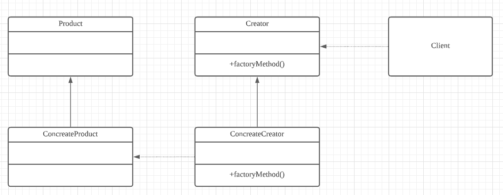

# Factory Method Pattern

## 팩토리 메소드 패턴  
***인터페이스를 통해 객체를 생성하지만 서브 클래스가 객체 생성에 필요한 클래스를 선택한다.***

- 팩토리 메소드 디자인은 유동적이다. 심플 팩토리 메소드와는 다르게 특정 객체 대신 인스턴스나 서브 클래스 객체를 반환할 수도 있다.
    - 객체와 인스턴스 차이점
        - 객체 : 클래스에 선언된 모양 그대로 생성된 실체. 즉 구현할 대상
        - 인스턴스 : 객체에 포함된다고 할 수 있다. 객체가 메모리에 할당되어 실제 사용될 때 “인스턴스” 라고 부른다.
        - 객체(Object)는 현실의 대상(Object)과 비슷하여, 상태나 행동 등을 가지지만, 소프트웨어 관점에서는 그저 콘셉(concept), 즉 사유의 결과일 뿐이다. 소프트웨어에서 객체를 구현하기 위해서는 콘셉 이상으로 많은 것들을 사고하여 구현해야 하므로, 이를 위한 설계도로 클래스를 작성한다. 설계도를 바탕으로 객체를 소프트웨어에 실체화 하면 그것이 인스턴스(Instance)가 되고, 이 과정을 인스턴스화(instantiation)라고 한다. 실체화된 인스턴스는 메모리에 할당된다.
        - 코딩을 할 때, 클래스 생성에 따라 메모리에 할당된 객체인 인스턴스를 ‘객체’라고 부르는데, 틀린 말이 아니다. 인스턴스는 객체에 포함되는 개념이기 때문이다.

- UML 다이어그램

  - `factoryMethod()` 메소드를 포함하는 `Creator` 추상클래스가 있다.
  - `factoryMethod()` 객체 생성을 담당한다.
  - `ConcreateCreator` 클래스의 `factoryMethod()` 는 `Creator` 추상 클래스의 메소드를 구현하고 생성된 객체를 런타임에 반환한다.
  - `ConcreateCreator` 클래스는 `ConcreateProduct` 를 생성하고 생성된 객체는 `Product` 클래스를 상속받아 `Product` 인터페이스의 모든 함수를 포함시킨다.
  - 정리하면 `Creator` 인터페이스의 `factoryMethod()`  와 `ConcreateCreator` 클래스는 `Product`  클래스의 어떤 서브 클래스를 생성할지를 결정한다.

### 팩토리 메소드 구현

- Linkedin이나 페이스북 같은 소셜 네트워크에 특정 사용자나 기업의 프로필을 작성하는 경우를 생각해 보면 프로필에는 여러 세션이 있다.
- Linkedin에는 특허나 경력을 기입할 수 있고, 페이스북에는 여행 사진을 올릴 수도 있다.
- 공통적으로 기입해야 하는 개인 정보도 있다.
- 이렇게 서비스 종류에 따라 알맞은 내용을 포함하는 프로필을 생성하는 코드를 구현해 보겠다.

```python
from abc import ABCMeta, abstractmethod

class Section(metaclass=ABCMeta):
    @abstractmethod
    def describe(self):
        pass

class PersonalSection(Section):  # 개인 섹션
    def describe(self):
        print("Personal Section")

class AlbumSection(Section):  # 앨범 섹션
    def describe(self):
        print("Album Section")

class PatentSection(Section):  # 특허 섹션
    def describe(self):
        print("Patent Section")

class CareerSection(Section):  # 경력 섹션
    def describe(self):
        print("Career Section")
```
- 우선 `Product` 인터페이스를 선언한다. `Section` 추상 클래스는 프로필의 각 세션을 나타내고, 간단하게 `describe()` 추상 메소드만 포함한다.
- 다음으로 `ConcreateProduct` 클래스에 해당하는 `PersonalSection`, `AlbumSection`, `PatentSection`, `CareerSection` 클래스를 선언하고, 각 클래스에는 해당 세션명을 출력하는 `describe()` 가 있다.

<br/>

```python
from abc import ABCMeta, abstractmethod

from factory.factory_method_section import PersonalSection, AlbumSection, PatentSection, CareerSection

class Profile(metaclass=ABCMeta):
    def __init__(self):
        self.sections = []
        self.create_profile()

    @abstractmethod
    def create_profile(self):
        pass

    def get_sections(self):
        return self.sections

    def add_sections(self, section):
        self.sections.append(section)

class LinkedIn(Profile):
    def create_profile(self):
        # 개인세션, 특허세션, 경력세션
        self.add_sections(PersonalSection())
        self.add_sections(PatentSection())
        self.add_sections(CareerSection())

class Facebook(Profile):
    def create_profile(self):
        # 개인세션, 앨범세션
        self.add_sections(PersonalSection())
        self.add_sections(AlbumSection())

if __name__ == '__main__':
    profile_type = input("어떤 소셜 네트워크의 프로필을 생성하시겠습니까? [LinkedIn or Facebook]")
    social_network = eval(profile_type)()
    print(f"Creating Profile type.. {type(social_network)}")
    print(f"Creating Profile name.. {type(social_network).__name__}")
    print(f"Profile has sections -- {social_network.get_sections()})") 

----------
result
----------
어떤 소셜 네트워크의 프로필을 생성하시겠습니까? [LinkedIn or Facebook]Facebook
Creating Profile type.. <class '__main__.Facebook'>
Creating Profile name.. Facebook
Profile has sections -- [<factory.factory_method_section.PersonalSection object at 0x7fd14f400250>, <factory.factory_method_section.AlbumSection object at 0x7fd14f495eb0>])
```

- `Creator` 추상 클래스를  `Profile`  이름으로 선언한다. `Profile` 추상 클래스는  팩토리 메소드이자 추상 메소드인 `create_profile` 를 제공한다.
- `Profile` 추상 클래스에는 각 프로필에 들어갈 세션에 대한 정보가 없고 서브 클래스가 결정한다.
- `ConcreateCreator` 클래스를 생성하고 각 클래스에는 세션을 생성하는 `create_profile()` 추상 메소드를 구현한다.
    - 소셜 네트워크 서비스 특성에 맞는 세션을 포함한 프로필을 생성한다
    - `LinkedIn`  개인세션, 특허세션, 경력세션
    - `Facebook`  개인세션, 앨범세션
- 마지막으로 클라이언트 코드를 작성하여 호출한다.
    - ***인터페이스를 통해 객체를 생성 →*** FaceBook을 입력하면 `Facebook[ConcreateCreator]` 클래스가 생성되고, 슈퍼 클래스인 `Profile` 클래스의 `__init__` 메소드에서 추상메소드를 호출한다. 이에 추상메소드의 구현체인 `Facebook` 클래스의 `create_profile` 이 호출된다.
    - ***서브 클래스가 객체 생성에 필요한 클래스를 선택→*** `create_profile()` 호출을 통해 내부적으로는 `ConcreateProduct` 클래스인 `PersonalSection`과 `AlbumSection` 이 생성된다.

## 팩토리 메소드 패턴의 장점

- 특정 클래스에 종속적이지 않기 때문에 개발 및 구현이 쉽다. `ConcreateProduct` 클래스가 아닌 `Product` 인터페이스에 의존한다.
- 객체를 생성하는 코드와 활용하는 코드가 분리돼 읜존성이 줄어든다. 클라이언트에서는 어떤 인자를 넘겨야 하고, 어떤 클래스를 생성해야 하는지 걱정할 필요가 없다. 새로운 클래스를 쉽게 추가할 수 있고, 유지보수가 쉽다.

## 팩토리 메소드의 단점

- 패턴을 구현할 많은 서브 클래스를 도입합으로써 코드가 복잡 해 질 수 있다.