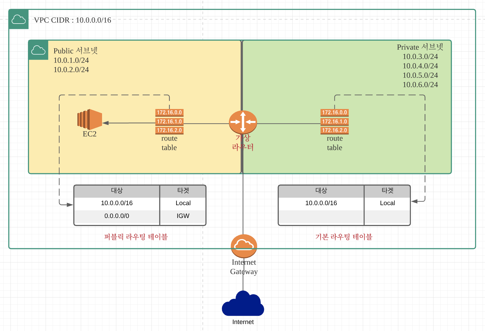
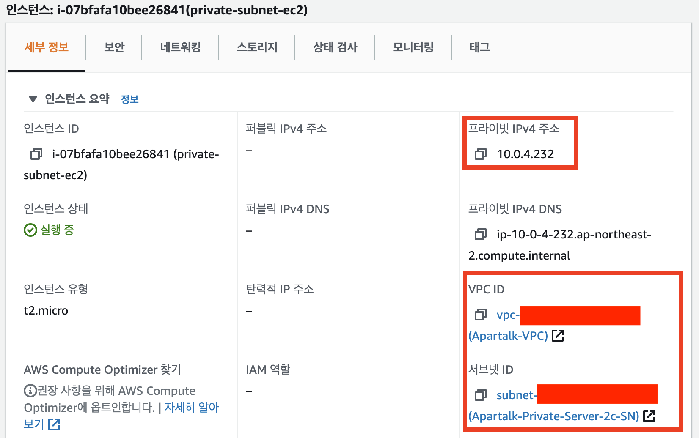

# [AWS] 2. VPC 구성 - 2

## 앞서 [VPC 구성 -1](./2021-04-19-aws-vpc-1.md) 에서는 아래에 대한 내용을 진행하였다.

1. VPC 구성
2. 퍼블릭 / 프라이빗 서브넷 생성
3. IGW 생성 및 VPC 연동
4. 퍼블릭 라우팅 테이블 생성 + 퍼블릭 서브넷 연결
5. 퍼블릭 라우팅 테이블 라우팅 경로 설정
6. EC2 검증

## 이번에는 아래 내용을 진행한다.

1. NAT 게이트웨이 생성
2. 프라이빗 라우팅 테이블 생성 + 프라이빗 서브넷 연결
3. 프라이빗 라우팅 테이블 경로 추가
4. EC2 검증

<br/>

### 현재까지 진행한 VPC 도식화는 아래와 같다.


:::info
프라이빗 서브넷은 아직 기본 라우팅 테이블을 사용 중이다
:::
<br/>

### NAT 게이트웨이 생성

- NAT 게이트웨이의 역할은 아래와 같다. 즉, 프라이빗 서브넷 인스턴스의 프라이빗 IP를 퍼블릭 IP로 변환하여 외부 인터넷으로 연결할 수 있게 해준다. 또한, NAT 게이트웨이는 한쪽 방향으로만 동작하기 때문에, 프라이빗 서브넷 → 외부 인터넷으로 통신이 가능하지만 외부 인터넷 → 프라이빗 서브넷으로 통신은 불가능하다.

<br/>

- 프라이빗 서브넷에서 외부 인터넷 구간 통신을 하기 위해 NAT 게이트웨이를 생성한다.

<br/>

- 2개의 퍼블릭 서브넷에 NAT를 생성할 것이기 때문에 아래와 같이 생성한다. 이후, NAT를 하나 더 생성한다.
- NAT는 위치상 퍼블릭 서브넷에 생성해야 한다

<br/>

- 생성된 NAT 게이트웨이를 확인한다.

<br/>

### 프라이빗 라우팅 테이블 생성 및 서브넷 연결

- 프라이빗 라우팅 테이블을 생성한다.

<br/>

- 2개의 프라이빗 라우팅 테이블을 생성한다.

<br/>

- 생성된 라우팅 테이블을 확인한다.

<br/>

- 프라이빗 라우팅 테이블과 프라이빗 서브넷을 연결한다. 각 가용영역(2a, 2c)를 확인하여 연결해준다.


:::info
Private-2a-RT → Private-2a-SN, Private-DB-2a-SN <br/>
Private-2c-RT → Private-2c-SN, Private-DB-2c-SN
:::
<br/>

### 프라이빗 라우팅 테이블 경로 추가

- 프라이빗 라우팅 테이블에 NAT 게이트웨이를 추가한다.


- 현재까지 VPC 도식화는 아래와 같다.

<br/>

### 검증

- EC2를 생성한다. 크게 주의할 점은 없고 VPC와 프라이빗 서브넷만 제대로 지정해 준다.

<br/>

- 고급 세부 정보 → 사용자 데이터에 아래 내용을 추가한다.


```bash
  #!/bin/bash
  (
  echo "qwe123"
  echo "qwe123"
  ) | passwd --stdin root
  sed -i "s/^PasswordAuthentication no/PasswordAuthentication yes/g" /etc/ssh/sshd_config
  sed -i "s/^#PermitRootLogin yes/PermitRootLogin yes/g" /etc/ssh/sshd_config
  service sshd restart
```
:::info
SSH 접속 시 EC2 인스턴스에 키페어 없이 root 계정의 암호 입력 방식으로 로그인을 하는 script이다.
:::
<br/>

- 보안그룹, 보안 키 생성 후 EC2를 생성한다. 인스턴스가 생성되면 지정한 VPC와 서브넷, IPv4 주소를 제대로 가져왔는지 확인해본다.


- EC2가 프라이빗 서브넷에 있기 때문에 퍼블릭 서브넷처럼 접근할 수가 없다. 따라서, Bastion 서버를 올려서 접근해야 하지만, 이 부분은 추후에 다른 세션으로 다뤄보고, 위에서 입력한 유저데이터의 암호 접근방식으로 접속 해보겠다.


- 핑이 잘 나가는 것을 확인한다. 
#### 여기까지 해서 VPC 구성을 완료해 보았다.
