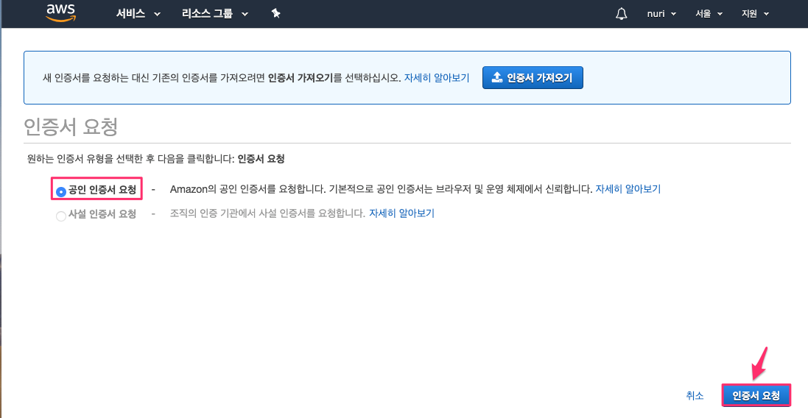

# [AWS] 4. Certificate Manager

## 인증서 추가 (AWS Certificate Manager에서 HTTPS를 위한 SSL/TLS 인증서 발급)
- 상단의 [서비스] 메뉴에서 “certifacate manager”로 필터링 후 선택한다. 
  - 리전이 서울로 되어있는데 추후에 CloudFrount와 같은 글로벌 CDN서비스를 이용하려면 미국동부(버지니아 북부)리전에서 신청을 해야 한다.
  - 서울에서 LB용 인증서를 사용해야 하면, 서울리전에서 별도로 인증서를 받아야 한다. 나의 경우는 둘다 해당하니 각 리전에서 전부 받는다.

 

- [공인 인증서 요청] 을 선택한다.

- 도메인 이름을 추가한다. 와일드카드를 이용하여 [*.xxxxx.com] 을 추가하고 [다음] 버튼을 클릭한다.
  - [xxxxx.com] 도 추가한다. *를 써도 xxxxx.com는 사용할 수 없기 때문에
 

- DNS 검증 방법을 선택하면 검증 방법은 아래와 같다.

1. AWS Certificate Manager(ACM)에서 정해주는 토큰을 DNS서버에 가서 CNAME 레코드로 등록해 준다.
2. ACM은 해당 DNS서버(여기서 우리는 Route53에 해당)로 요청을 보내서, 검증 토큰과 일치하는 응답이 오는지를 검사한다.

만약 외부 DNS를 사용하면 레코드를 복사해서 해당 DNS 설정에 가서 붙여넣기를 해야하지만, 현재 AWS 울타리 안에 있으므로 이 부분은 편리하게 자동으로 처리해 준다.

- [Route53에서 레코드 생성] 버튼 누르면 생성 성공메세지를 볼 수 있다

