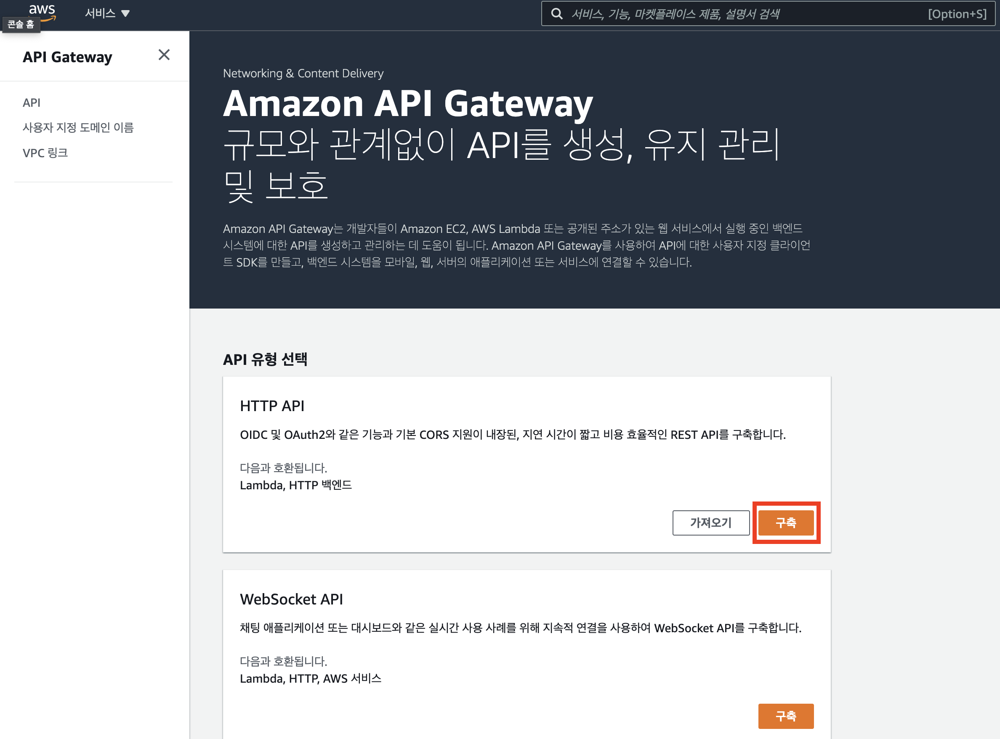

# [AWS] 7. API Gateway

## API Gateway
### API 유형선택
- HTTP API를 선택하고 [구축] 버튼을 클릭한다.

### API 생성
- API 이름을 작성한다. 통합, 경로, 스테이지는 API 생성 후 가능하기 때문에 바로 [검토 및 생성] 을 한다.

### VPC 링크
- API GATEWAY → Private ALB 로 라우팅 해줄 것이기 때문에 VPC링크를 생성 해줘야 한다. 먼저 보안그룹을 생성해준다.

 

- HTTP API 링크 버전으로 생성한다.  위에서 생성한 보안 그룹을 써주고, 서브넷은 ec2가 있는 private subnet을 설정해 준다. 다만, AGW → ALB 로 라우팅해 줄 것인데, ALB가 internal 로 만들었다는 것과 가용영역이 private 서브넷이라는 것밖에 확인이 안되는데 아래와 같이 설정하는 것이 맞는지 의문스럽긴 하다.

### 경로 연결
- 생성한 API의 경로를 연결해 준다. 경로 설정에서 /login, /community 등과 같이 URI를 분기처리 해 준다. 일단, 제대로 된 서버 소스가 올라간 것이 아니기 때문에 간단한 동작 확인을 "/ " 로 진행한다.

### 통합을 경로에 연결
- 생성한 경로에 통합을 생성해 준다.

 

- 통합 대상은 프라이빗 리소스를 선택한다.
- 앞서 생성한 ALB와 VPC링크를 선택한다.

### 사용자 지정 도메인 이름

- API 매핑을 한다.

- Route53 에서 레코드를 생성한다.
- 단순 레코드 정의 시 리소스가 검색이 안될 수 있는데 좀 기다리면 보여진다. (아래의 d-fp8qc6...)

 

- 사용자 지정 도메인으로 접속 테스트를 한다.
- 만약 접속이 안될경우 기다리면 된다. Document상으로는 40분 정도 걸린다고 하는데 약 5~10분 정도면 완료된다.