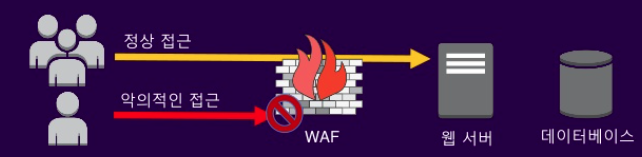

# [AWS] WAF

## Web Application Firewall (WAF) 역할

- Web Application Firewall (WAF) : HTTP 트래픽에 대하여 특정한 규칙을 적용하기 위한 어플라이언스, 웹서버 플러그인/필터 형태의 보안 제품
- 중요 데이터 유출사고 및 서비스 중단 등을 발생시킬 수 있는 웹사이트 또는 어플리케이션에 대한 공격 방어
- 일반적인 사용 케이스
  - 취약점 이용한 공격을 방어(SQL Injection, Cross Site Scripting(XSS))
  - 악의적인 요청 대응(Web Crawler, Scrapers, Direct links)
  - L7 디도스 완화(HTTP/ HTTPS floods)

## 기존 웹 방화벽(WAF)의 문제점

- 제대로 구축하기가 어렵고 시간이 많이 걸림
- 오탐율이 많은 규칙들
- 트래픽이 폭증할 때 확장에 한계
- 자동화를 위한 API 부족
- 유지보수에 과다한 노력 필요

## AWS WAF의 장점

- 쉽게 구성 가능하다.
- 유연한 커스터마이징
- 개발과 통합 가능

## AWS WAF의 단점

- 사용량에 비례하는 과금구조

## AWS WAF 제공 기능

### CloudFront / ALB / API Gateway (워크로드 보호)

### 트래픽 필터링

## API 및 관리 콘솔

## 실시간 모니터링 및 Reporting

## WAF 설정 방법

### Rule Groups 생성

- 룰 그룹을 먼저 생성한다. 참고로, 룰 그룹을 이용하지 않으면 ACL 생성 시에 룰 변경이 불가능하여 삭제 후 재생성해야 할 수 있다. 잦은 변경이 필요하다면 룰 그룹을 생성하고 거기에 먼저 룰을 만들어서 이미 만들어진 룰을 가져오는 방식으로 새로운 룰을 추가하는 것이 좋다.

- 아래과 같이 정보 입력하여 룰 그룹을 생성한다.

- 룰을 추가한다.

- 테스트용으로 한국 IP를 차단하는 룰을 생성한다.

- 용량을 설정한다. 용량은 규칙 그룹에서 규칙의 수와 복잡성을 제한한다. 규칙 그룹을 생성 한후에는 용량을 변경할 수 없다.

- 룰 순서를 배정한다. 위에서부터 시작하여 표시된 순서대로 규칙을 평가한다.

- 리뷰 화면에서 이상이 없으면 룰 그룹을 생성한다.

### Web ACL 생성

- ALB용 ACL을 생성한다.

- 앞서 생성한 룰 그룹을 넣는다

- 규칙과 일치 하지 않는 요청에 대한 default action은 허용해준다.

- 룰에 대한 우선순위를 설정한다. (룰 그룹안의 룰끼리도 이미 우선순위가 있으므로 이건 더 큰 의미의 우선순위가 된다.)

- CloudWatch 지표 모니터링을 위한 설정을 해준다.

- 리뷰 후 이상이 없으면 web ACL을 생성 해준다.

## 특정국가 제외 모든 IP 차단

### 한국, 미국만 허용 하는 룰 생성
:::tip
미국을 허용해야 Apple 심사 통과)
:::

### 특정 국가 차단 완료한 상태

## Product Level에서 사용해 볼만한 Rules

### 총 4개의 managed rules

## CDN Web ACLs

### 총 5개의 managed rules + 국가차단 룰은 안했음

