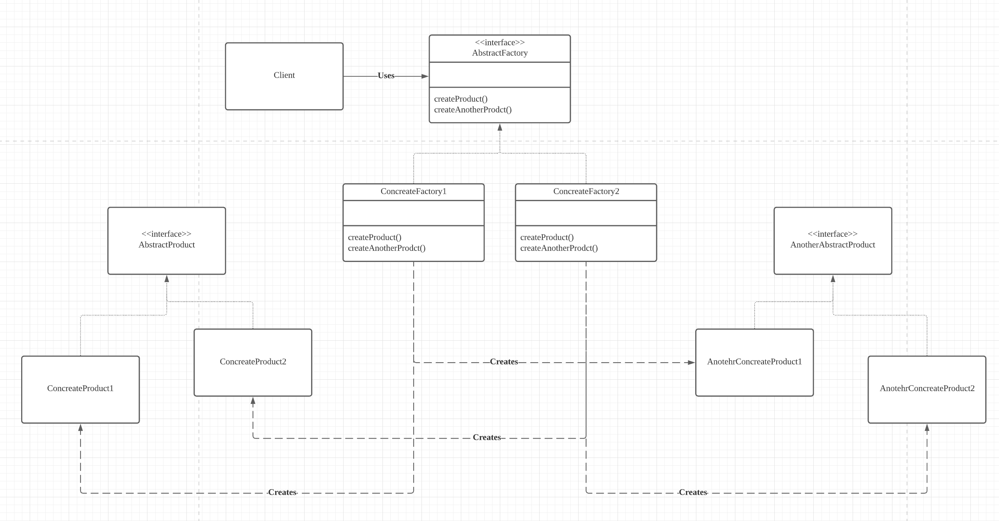
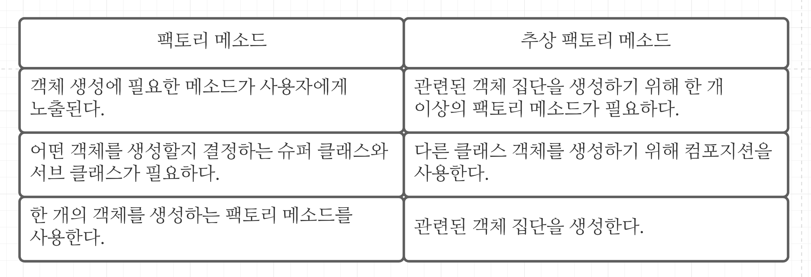

# Abstract Factory Pattern

## 추상 팩토리 패턴
- 추상 팩토리 패턴의 주목적은 클래스를 직접 호출하지 않고 관련된 객체를 생성하는 인터페이스를 제공하는 것이다.
- 이전 글에서 포스팅한 팩토리 메소드가 인스턴스 생성을 서브 클래스에게 맡기는 반면 추상 팩토리 패턴에서는 추상 팩토리 메소드가 관련된 객체의 집합을 생성한다.

## UML 다이어그램
- 추상 팩토리 패턴 UML 다이어그램

  - `ConcreteFactory1` 과 `ConcreteFactory2` 는 `AbstractFactory` 인터페이스에서 생성된다.
  - `ConcreteFactory1` 과 `ConcreteFactory2` 는 `AbstractFactory` 를 상속받고 `ConcreteProduct1` 과 `ConcreteProduct2`, `AnotherConcrateProduct1` , `AnotherConcreteProduct2` 인스턴스를 생성한다.
  - `ConcreteProduct1` 과 `ConcreteProduct2` 는 `AbstractProduct` 인터페이스에서 생성되고 `AnotherConcrateProduct1` 과 `AnotherConcreteProduct2` 는 `AnotherAbstractProduct` 인터페이스에서 생성된다.
  - 추상 팩토리 패턴에서 클라이언트는 객체 생성 로직과 상관없이 생성된 객체를 사용한다.
  - 클라이언튼 오직 인터페이스를 통해 객체에 접근할 수 있다.
  - 추상 팩토리 패턴은 플랫폼에 필요한 서비스 생성을 알아서 처리하기 때문에 클라이언트는 플랫폼에 종속된 객체를 직접 생성할 필요가 없다.

## 추상 팩토리 패턴 구현 예

- 여러 종류의 피자를 판매하는 피자 가게 있다.
- 이 피자가게에서는 한국식 피자와 미국식 피자를 판매하고 있고, 각각 채식주의자를 위해 채식 피자, 고기가 들어간 일반 피자를 나누어 팔고 있다.
- 채식피자는 크러스트와 채소, 양념으로 조리하고, 일반 피자는 채식 피자 위에 여러가지 토핑을 추가해 조리한다.
- 핵심은 채식피자 베이스로 일반 피자가 만들어진다는 점이다.

### AbstractProduct, ConcreateProduct 생성

- `AbstractProduct`에 해당하는 `VegPizza` , `NonVegPizza`  추상 클래스를 생성한다.
- 각 클래스에는 `prepare()` 와 `serve()`메소드를 선언한다.
- `AbstractProduct` 별로 `ConcreteProducts` 를 선언한다.
- `DeluxVeggiePizza`와 `MexicanVegPizza`를 선언하고 `prepare()` 메소드를 구현한다. UML 다이어그럼에서의 `ConcreteProduct1`, `ConcreteProduct2` 에 해당한다.
- `ChickenPizza`와  `HamPizza`를 선언하고 serve() 메소드를 구현한다.  UML 다이어그럼에서의 `AnotherConcreteProduct1`, `AnotherConcreteProduct2` 에 해당한다.

```python
from abc import ABCMeta, abstractmethod

class VegPizza(metaclass=ABCMeta):
    def __init__(self):
        self.prepare()

    @abstractmethod
    def prepare(self):
        pass

class NonVegPizza(metaclass=ABCMeta):
    def __init__(self, veg_pizza: VegPizza):
        self.serve(veg_pizza)

    @abstractmethod
    def serve(self, veg_pizza: VegPizza):
        pass

class DeluxVeggiePizza(VegPizza):
    def prepare(self):
        print(f"Prepare {type(self).__name__}")

class MexicanVegPizza(VegPizza):
    def prepare(self):
        print(f"Prepare {type(self).__name__}")

class ChickenPizza(NonVegPizza):
    def serve(self, veg_pizza: VegPizza):
        print(f"{type(self).__name__}, is served with Chicken on {type(veg_pizza).__name__}")

class HamPizza(NonVegPizza):
    def serve(self, veg_pizza: VegPizza):
        print(f"{type(self).__name__}, is served with Ham on {type(veg_pizza).__name__}")
```

### AbstractFactory, ConcreteFactory 생성

- 우선 인터페이스 추상 클래스 `PizzaFactorty`  를 선언한다.
- `PizzaFactorty` 클래스에는 `ConcreteFactory` 가 상속받을 `create_veg_pizza()` (채식주의자를 위한 피자), `create_non_veg_pizza` (채식주의자와 상관없는 피자) 두개의 추상 메소드가 있다.
- `ConcreteFactory` 에 해당하는 `KoreanPizzaFactory` , `AmericanPizzaFactory` 2개 클래스를 생성한다.

```python
from abc import ABCMeta, abstractmethod

from factory.pizza_product_factory import DeluxVeggiePizza, ChickenPizza, MexicanVegPizza, HamPizza

class PizzaFactory(metaclass=ABCMeta):
    def __init__(self, is_veg: bool):
        self.is_veg = is_veg
        self.veg_pizza = self.create_veg_pizza()
        self.non_veg_pizza = self.create_non_veg_pizza()

    @abstractmethod
    def create_veg_pizza(self):
        print("PizzaFactory create_non_veg_pizza")
        pass

    @abstractmethod
    def create_non_veg_pizza(self):
        print("PizzaFactory create_non_veg_pizza")
        pass

class KoreanPizzaFactory(PizzaFactory):
    def create_veg_pizza(self):
        return DeluxVeggiePizza()

    def create_non_veg_pizza(self):
        if self.is_veg:
            print(f"{type(self).__name__}, is served {type(self.veg_pizza).__name__}")
            return None

        return ChickenPizza(self.veg_pizza)

class AmericanPizzaFactory(PizzaFactory):
    def create_veg_pizza(self):
        return MexicanVegPizza()

    def create_non_veg_pizza(self):
        if self.is_veg:
            print(f"{type(self).__name__}, is served {type(self.veg_pizza).__name__}")
            return None

        return HamPizza(self.veg_pizza)
```

### Clinet 코드 작성

- 사용자가 피자가게에서 비채식 한국식 피자를 요청하면 KoreanPizaaFactory가 채식피자를 준비하고 치킨 토핑을 얹어 제공한다.

```python
from factory.pizza_abstract_factory import AmericanPizzaFactory, KoreanPizzaFactory

class PizzaStore:
    def __init__(self):
        pass

    def make_pizzas(self, pizza_style: str, is_veg: bool):
        if pizza_style.lower() == "k":
            KoreanPizzaFactory(is_veg)
        else:
            AmericanPizzaFactory(is_veg)

if __name__ == "__main__":
    pizza = PizzaStore()
    pizza.make_pizzas(pizza_style="K", is_veg=False)

---------
result
---------
Prepare DeluxVeggiePizza
ChickenPizza, is served with Chicken on DeluxVeggiePizzak
```

## 팩토리 메소드, 추상 팩토리 차이점


- 컴포지션
    - private 필드를 통하여 기존의 클래스가 새로운 클래스의 구성요소(인스턴스)로 쓰이는 것
        
        ```python
        class PizzaFactory(metaclass=ABCMeta):
            def __init__(self, is_veg: bool):
                self.is_veg = is_veg
                self.veg_pizza = self.create_veg_pizza()
                self.non_veg_pizza = self.create_non_veg_pizza()    
        
        		def create_non_veg_pizza(self):
                if self.is_veg:
                    return None
        
                return ChickenPizza(self.veg_pizza)
        ```
        
    - 새로운 클래스에 기존 클래스의 영향이 적어 기존 클래스가 변경되어도 안전함(변화에 유연함)
    

## 정리

### 심플팩토리 패턴

- 런타임에 클라이언트가 넘긴 객체형 인자를 기반으로 인스턴스를 생성한다.

### 팩토리 메소드 패턴

- 인터페이스를 통해 객체를 생성하지만 실제 생성은 서브 클래스가 담당한다.

### 추상 팩토리 패턴

- `Concrete` 클래스를 명시하지 않고 관련된 객체의 집단을 생성한다.